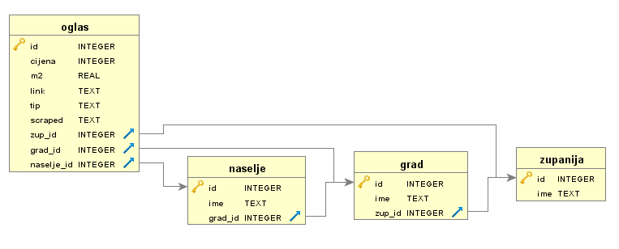

# **THIS SCRAPER DOES NOT WORK** 
The site njuškalo.hr has deployed anti-scraping systems and this scraped is outdated.


# njuskalo-nekretnine
Collecting  realestate listings from [njuškalo](http://www.njuskalo.hr/), most popular Croatian listing website

## Built With
* [Scrapy](https://scrapy.org/) - Python scraping framework
* [peewee](http://docs.peewee-orm.com/en/latest/) - simple and small ORM

## Database schema
Easily modified using the OglasModel.py and then execute the setup_database.py script (or use the console) to create the database schema


## Running the scraper
There are four spiders, depending on the type you want to scrape. Both types get stored into the same database with different oglas.tip fields. Run with:
```
scrapy crawl rent_stan
scrapy crawl prodaja_stan
scrapy crawl rent_kuca
scrapy crawl prodaja_kuca
```
Running the spiders like this will scrape the contents but if you want to scrape to check for active listings (maby cron the script) use the scraper_script:
```
python scraper_script.py
```

## Warning!
Whatever you scrape, scrape responsibly by obeying robots.txt and throttle your requests! If you publish the information, make links back to the source!
